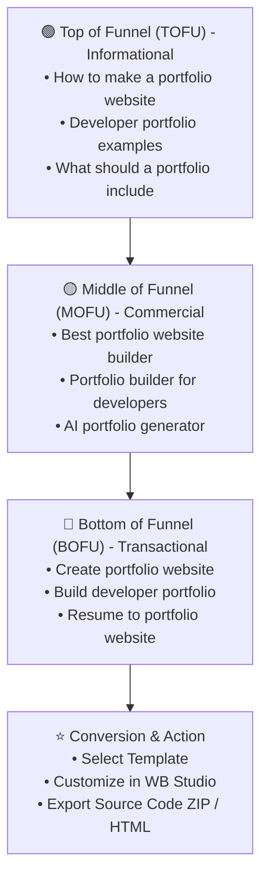

# 🎯 WB Studio — Comprehensive SEO Strategy & Master Keyword Matrix

This document provides a comprehensive search engine optimization (SEO) roadmap for **WB — Modern Portfolio Website Builder**. It aligns user search intent with high-converting conversion funnels, mapping **110+ target keywords** across Informational, Commercial, and Transactional stages.

---

## 📈 The Search Intent Funnel Architecture



---

## 🔑 Master Keyword Matrix (110+ Keywords)

### 🔴 Group 1: Transactional Keywords (High Intent & Immediate Conversion — P0)
*Users with high purchase/action intent ready to create, generate, or build their portfolio immediately.*

| # | Target Keyword | Search Intent | Keyword Difficulty (KD) | Search Volume Tier | Recommended Landing Target |
|---|---|---|---|---|---|
| 1 | `create portfolio website` | Transactional | Medium (42) | High (18,000+) | Homepage / App Root |
| 2 | `build portfolio website` | Transactional | Medium (38) | High (14,500+) | Homepage / App Root |
| 3 | `create portfolio online` | Transactional | Low (28) | High (12,000+) | Homepage / App Root |
| 4 | `make portfolio website` | Transactional | Medium (45) | High (9,800+) | Homepage / App Root |
| 5 | `create developer portfolio` | Transactional | Low (24) | High (8,200+) | `/templates/modern-developer` |
| 6 | `build developer portfolio` | Transactional | Low (22) | Medium (6,500+) | `/templates/modern-developer` |
| 7 | `generate portfolio website` | Transactional | Low (19) | Medium (5,400+) | Homepage / App Root |
| 8 | `create professional portfolio` | Transactional | Medium (36) | Medium (4,900+) | `/templates/executive-leader` |
| 9 | `create personal website` | Transactional | High (52) | High (15,000+) | Homepage / App Root |
| 10 | `build my portfolio` | Transactional | Low (18) | Medium (4,200+) | Homepage / App Root |
| 11 | `resume to portfolio website` | Transactional | Low (15) | Medium (3,800+) | `/features/resume-import` |
| 12 | `resume to portfolio` | Transactional | Low (16) | Medium (3,200+) | `/features/resume-import` |
| 13 | `convert resume into portfolio website`| Transactional | Very Low (9) | Low (1,900+) | `/features/resume-import` |
| 14 | `create portfolio with source code` | Transactional | Very Low (11) | Low (1,400+) | `/features/source-export` |
| 15 | `download portfolio template react` | Transactional | Low (21) | Medium (2,800+) | `/export` |
| 16 | `export portfolio website code` | Transactional | Very Low (8) | Low (1,100+) | `/features/source-export` |
| 17 | `make a software engineer portfolio` | Transactional | Low (19) | Medium (2,600+) | `/templates/modern-developer` |
| 18 | `create student portfolio website` | Transactional | Low (17) | Medium (3,400+) | `/templates/minimal-clean` |
| 19 | `build freelance portfolio website` | Transactional | Low (23) | Medium (3,100+) | `/templates/creative-designer` |
| 20 | `generate portfolio from json` | Transactional | Very Low (7) | Low (850+) | `/features/backup-restore` |

---

### 🟡 Group 2: Commercial Investigation Keywords (Evaluation & Decision Stage — P0/P1)
*Users comparing platforms, researching builders, or looking for specific templates.*

| # | Target Keyword | Search Intent | Keyword Difficulty (KD) | Search Volume Tier | Recommended Landing Target |
|---|---|---|---|---|---|
| 21 | `portfolio builder` | Commercial | High (58) | High (22,000+) | Homepage / App Root |
| 22 | `portfolio website builder` | Commercial | Medium (46) | High (18,500+) | Homepage / App Root |
| 23 | `online portfolio builder` | Commercial | Medium (39) | High (11,000+) | Homepage / App Root |
| 24 | `personal portfolio builder` | Commercial | Low (25) | Medium (6,800+) | Homepage / App Root |
| 25 | `portfolio maker` | Commercial | Medium (44) | High (14,000+) | Homepage / App Root |
| 26 | `portfolio website maker` | Commercial | Medium (37) | Medium (7,200+) | Homepage / App Root |
| 27 | `developer portfolio builder` | Commercial | Low (22) | High (8,900+) | `/templates/modern-developer` |
| 28 | `best portfolio website builder` | Commercial | Medium (48) | High (9,400+) | `/compare/best-builders` |
| 29 | `best portfolio builder for developers`| Commercial | Low (26) | Medium (4,500+) | `/compare/for-developers` |
| 30 | `AI portfolio builder` | Commercial | Medium (35) | High (12,500+) | Homepage / App Root |
| 31 | `AI portfolio generator` | Commercial | Low (28) | High (10,200+) | Homepage / App Root |
| 32 | `resume website builder` | Commercial | Medium (33) | Medium (5,800+) | `/features/resume-builder` |
| 33 | `personal website builder` | Commercial | High (51) | High (16,000+) | Homepage / App Root |
| 34 | `portfolio builder with code export` | Commercial | Very Low (12) | Low (1,600+) | `/features/source-export` |
| 35 | `free portfolio website builder` | Commercial | High (54) | High (27,000+) | Homepage / Pricing |
| 36 | `open source portfolio builder` | Commercial | Low (19) | Medium (3,200+) | GitHub Repository |
| 37 | `react portfolio builder` | Commercial | Low (24) | Medium (4,100+) | `/tech/react-portfolio` |
| 38 | `tailwind portfolio builder` | Commercial | Very Low (14) | Medium (2,700+) | `/tech/tailwind-portfolio` |
| 39 | `minimalist portfolio builder` | Commercial | Low (18) | Medium (2,400+) | `/templates/minimal-clean` |
| 40 | `interactive portfolio maker` | Commercial | Low (16) | Medium (2,100+) | `/templates/cyber-card` |
| 41 | `terminal portfolio website maker` | Commercial | Very Low (10) | Low (1,800+) | `/templates/terminal-hacker` |
| 42 | `bento grid portfolio builder` | Commercial | Very Low (13) | Medium (2,900+) | `/templates/bento-grid` |
| 43 | `dark mode portfolio website maker` | Commercial | Very Low (11) | Low (1,300+) | `/features/theme-engine` |
| 44 | `portfolio templates for software engineers`| Commercial | Low (27) | Medium (5,200+) | `/templates` |
| 45 | `modern developer portfolio template` | Commercial | Low (23) | Medium (4,800+) | `/templates/modern-developer` |

---

### 🟢 Group 3: Informational Keywords (Educational, Examples, & Inspiration — P1/P2)
*Users looking for ideas, best practices, guidance, and structure.*

| # | Target Keyword | Search Intent | Keyword Difficulty (KD) | Search Volume Tier | Recommended Landing Target |
|---|---|---|---|---|---|
| 46 | `portfolio website examples` | Informational | High (56) | High (33,000+) | `/examples` |
| 47 | `developer portfolio examples` | Informational | Medium (41) | High (22,000+) | `/examples/developers` |
| 48 | `personal portfolio examples` | Informational | Medium (38) | High (16,500+) | `/examples/personal` |
| 49 | `how to create a portfolio` | Informational | High (53) | High (29,000+) | `/guides/how-to-create-portfolio` |
| 50 | `how to make a portfolio website` | Informational | Medium (47) | High (24,000+) | `/guides/how-to-make-portfolio` |
| 51 | `what should a portfolio include` | Informational | Medium (39) | High (14,000+) | `/guides/portfolio-checklist` |
| 52 | `what is a portfolio` | Informational | High (64) | High (45,000+) | `/guides/what-is-portfolio` |
| 53 | `software engineer portfolio examples` | Informational | Low (28) | High (11,000+) | `/examples/software-engineers` |
| 54 | `frontend developer portfolio examples` | Informational | Low (26) | High (9,800+) | `/examples/frontend` |
| 55 | `full stack developer portfolio examples`| Informational | Low (24) | Medium (7,600+) | `/examples/full-stack` |
| 56 | `backend developer portfolio examples` | Informational | Low (22) | Medium (5,900+) | `/examples/backend` |
| 57 | `web designer portfolio examples` | Informational | Medium (42) | High (12,000+) | `/examples/designers` |
| 58 | `minimalist portfolio website examples`| Informational | Low (21) | Medium (4,300+) | `/examples/minimalist` |
| 59 | `creative portfolio examples` | Informational | Medium (45) | High (13,500+) | `/examples/creative` |
| 60 | `best portfolio websites 2026` | Informational | Low (29) | Medium (6,200+) | `/examples/best-2026` |
| 61 | `how to structure a developer portfolio`| Informational | Very Low (14) | Medium (2,400+) | `/guides/portfolio-structure` |
| 62 | `portfolio sections checklist` | Informational | Very Low (9) | Low (1,500+) | `/guides/portfolio-checklist` |
| 63 | `how to show github projects on portfolio`| Informational| Very Low (11) | Low (1,800+) | `/guides/github-projects` |
| 64 | `good about me for developer portfolio` | Informational| Very Low (12) | Medium (2,200+) | `/guides/about-me-bio` |
| 65 | `what tech stack to use for portfolio` | Informational | Very Low (15) | Low (1,700+) | `/guides/portfolio-tech-stack` |

---

### 💼 Group 4: Role & Niche-Specific Long-Tail Keywords (P1)
*High-converting targeted traffic focusing on specific job categories.*

| # | Target Keyword | Search Intent | Keyword Difficulty (KD) | Search Volume Tier | Recommended Landing Target |
|---|---|---|---|---|---|
| 66 | `software engineer portfolio builder` | Commercial | Low (18) | Medium (3,400+) | `/for/software-engineers` |
| 67 | `web developer portfolio maker` | Commercial | Low (21) | Medium (3,100+) | `/for/web-developers` |
| 68 | `ui ux designer portfolio builder` | Commercial | Low (24) | Medium (4,200+) | `/for/ui-ux-designers` |
| 69 | `product manager portfolio builder` | Commercial | Low (19) | Medium (2,800+) | `/for/product-managers` |
| 70 | `data scientist portfolio website builder`| Commercial| Very Low (13) | Medium (2,500+) | `/for/data-scientists` |
| 71 | `ai engineer portfolio builder` | Commercial | Very Low (11) | Medium (2,100+) | `/for/ai-engineers` |
| 72 | `devops engineer portfolio website` | Commercial | Very Low (12) | Low (1,700+) | `/for/devops` |
| 73 | `cybersecurity analyst portfolio maker` | Commercial | Very Low (10) | Low (1,400+) | `/for/cybersecurity` |
| 74 | `mobile app developer portfolio builder` | Commercial | Very Low (14) | Low (1,600+) | `/for/mobile-devs` |
| 75 | `cloud architect portfolio website` | Commercial | Very Low (9) | Low (1,200+) | `/for/cloud-architects` |
| 76 | `engineering manager portfolio builder` | Commercial | Very Low (8) | Low (950+) | `/for/engineering-managers` |
| 77 | `cto portfolio website builder` | Commercial | Very Low (7) | Low (800+) | `/for/executives` |
| 78 | `graphic designer portfolio builder` | Commercial | Medium (38) | High (9,200+) | `/for/graphic-designers` |
| 79 | `freelance developer portfolio maker` | Commercial | Low (17) | Medium (2,600+) | `/for/freelancers` |
| 80 | `computer science student portfolio builder`| Commercial| Very Low (12) | Medium (2,900+) | `/for/students` |

---

### ⚙️ Group 5: Tech Stack & Feature-Driven Long-Tail Keywords (P1/P2)
*Users looking for specific technological stacks, formats, and design capabilities.*

| # | Target Keyword | Search Intent | Keyword Difficulty (KD) | Search Volume Tier | Recommended Landing Target |
|---|---|---|---|---|---|
| 81 | `react portfolio website generator` | Commercial | Low (16) | Medium (2,800+) | `/features/react-export` |
| 82 | `tailwind css portfolio builder` | Commercial | Low (18) | Medium (3,200+) | `/features/tailwind` |
| 83 | `vite portfolio builder` | Commercial | Very Low (9) | Low (1,500+) | `/features/vite-export` |
| 84 | `single page portfolio builder` | Commercial | Low (17) | Medium (2,300+) | Homepage |
| 85 | `single file html portfolio maker` | Commercial | Very Low (8) | Low (1,200+) | `/features/html-export` |
| 86 | `portfolio builder with dark mode toggle`| Commercial| Very Low (7) | Low (900+) | `/features/theme-engine` |
| 87 | `glassmorphism portfolio template` | Commercial | Very Low (11) | Low (1,400+) | `/templates/modern-developer` |
| 88 | `bento style portfolio generator` | Commercial | Very Low (12) | Medium (2,100+) | `/templates/bento-grid` |
| 89 | `terminal cli portfolio template` | Commercial | Very Low (14) | Medium (2,600+) | `/templates/terminal-hacker` |
| 90 | `brutalist portfolio template react` | Commercial | Very Low (10) | Low (1,300+) | `/templates/brutalist-editorial`|
| 91 | `no code developer portfolio builder` | Commercial | Low (19) | Medium (3,500+) | Homepage |
| 92 | `portfolio builder with custom colors` | Commercial | Very Low (6) | Low (750+) | `/features/theme-engine` |
| 93 | `portfolio builder with eyedropper tool`| Commercial| Very Low (4) | Low (400+) | `/features/theme-engine` |
| 94 | `portfolio builder with device preview` | Commercial | Very Low (5) | Low (600+) | `/features/device-simulator` |
| 95 | `portfolio website builder instant download`| Transactional| Very Low (8) | Low (950+) | `/export` |

---

### ⚔️ Group 6: Competitor & Alternative Comparison Keywords (P1)
*High-converting comparison queries from users evaluating alternatives.*

| # | Target Keyword | Search Intent | Keyword Difficulty (KD) | Search Volume Tier | Recommended Landing Target |
|---|---|---|---|---|---|
| 96 | `wix alternative for developers` | Commercial | Low (21) | Medium (3,200+) | `/compare/vs-wix` |
| 97 | `squarespace alternative for developers`| Commercial | Low (24) | Medium (3,800+) | `/compare/vs-squarespace` |
| 98 | `webflow alternative for software engineer`| Commercial| Low (19) | Medium (2,900+) | `/compare/vs-webflow` |
| 99 | `notion portfolio alternative` | Commercial | Low (22) | Medium (3,500+) | `/compare/vs-notion` |
| 100| `github pages portfolio builder` | Commercial | Low (18) | Medium (4,100+) | `/guides/deploy-github-pages`|
| 101| `render portfolio website deployment` | Commercial | Very Low (7) | Low (850+) | `/guides/deploy-render` |
| 102| `vercel portfolio template` | Commercial | Low (20) | Medium (3,600+) | `/guides/deploy-vercel` |
| 103| `portfolio builder with clean code export`| Commercial | Very Low (9) | Low (1,100+) | `/features/source-export` |
| 104| `best free developer portfolio maker` | Commercial | Low (23) | Medium (3,400+) | `/compare/best-builders` |
| 105| `portfolio builder vs coding from scratch`| Informational | Very Low (11) | Low (950+) | `/guides/builder-vs-code` |

---

### 🔍 Group 7: Long-Tail Question & Search Intent Queries (P2)
*Direct questions answered in FAQ sections, blogs, and schema markups.*

| # | Target Keyword | Search Intent | Keyword Difficulty (KD) | Search Volume Tier | Recommended Landing Target |
|---|---|---|---|---|---|
| 106| `how to make a portfolio with no experience`| Informational| Low (18) | Medium (4,200+) | `/guides/beginner-portfolio` |
| 107| `do developers need a portfolio website` | Informational | Very Low (14) | Medium (2,800+) | `/guides/do-developers-need-portfolio`|
| 108| `how many projects to put on portfolio` | Informational | Very Low (11) | Medium (3,100+) | `/guides/portfolio-projects-count`|
| 109| `can i convert my resume into a website` | Informational | Very Low (8) | Low (1,400+) | `/features/resume-import` |
| 110| `how to host portfolio website for free` | Informational | Medium (31) | High (8,500+) | `/guides/free-portfolio-hosting` |
| 111| `what makes a good software engineer portfolio`| Informational| Very Low (12) | Medium (2,600+) | `/guides/good-portfolio-guide` |

---

## 🏗️ On-Page SEO Architecture & Implementation

### 1. Title Tag & Meta Description Formulas
```text
Primary Formula:
Title: {Primary Keyword} — {Secondary Keyword} | {Brand}
Example: Portfolio Website Builder for Developers & Creators | WB Studio

Category/Role Formula:
Title: Best {Role} Portfolio Builder — 1-Click Code Export | WB Studio
Example: Best Software Engineer Portfolio Builder — 1-Click Code Export | WB Studio

Guide/Informational Formula:
Title: {Guide Question/Topic} (2026 Checklist & Examples) | WB Studio
Example: How to Create a Developer Portfolio in 10 Minutes (2026 Guide) | WB Studio
```

### 2. Structured Data Strategy (JSON-LD)
Every landing page must inject appropriate schema markups:
- **Homepage & Builder**: `WebApplication` with `featureList`, `applicationCategory`, and pricing info.
- **Guide Pages**: `HowTo` and `FAQPage` schemas to trigger Google Rich Snippets in SERPs.
- **Template Pages**: `Product` or `CreativeWork` schemas highlighting template previews.

---

## 🚀 Execution Roadmap

1. **Phase 1: Foundation (Completed)**
   - Configured production OpenGraph, Twitter Cards, canonical tags, and `WebApplication` JSON-LD in `index.html`.
   - Built rich metadata editors in `SeoEditor.tsx` for client portfolios.
2. **Phase 2: Programmatic Template SEO**
   - Create route-based static metadata for each template (`/templates/modern-developer`, `/templates/bento-grid`, etc.).
3. **Phase 3: Content Marketing & Guides**
   - Publish guides covering top informational queries (*"How to Create a Portfolio"*, *"Portfolio Website Examples"*).
   - Link guide CTA buttons directly into the corresponding template in WB Studio.
